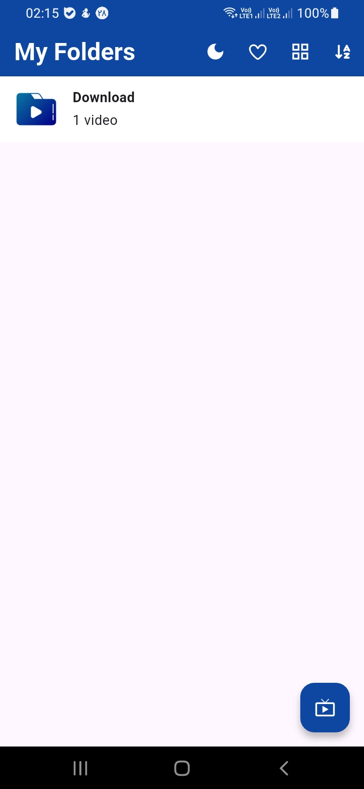
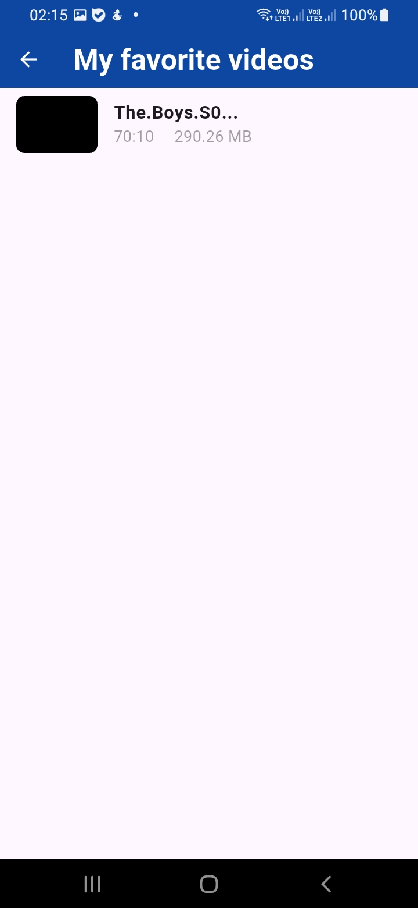
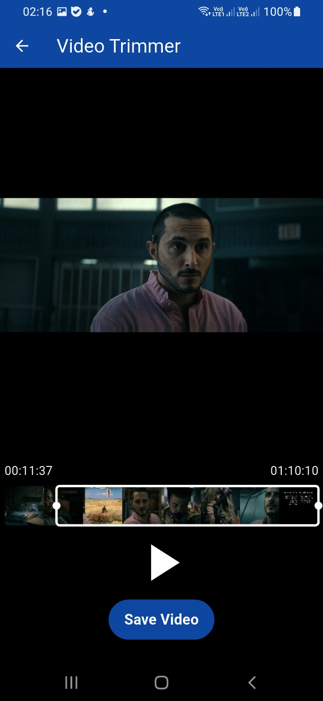
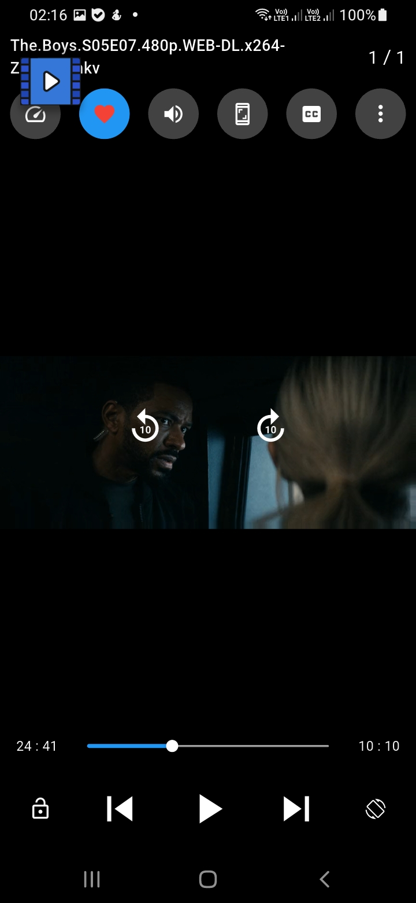
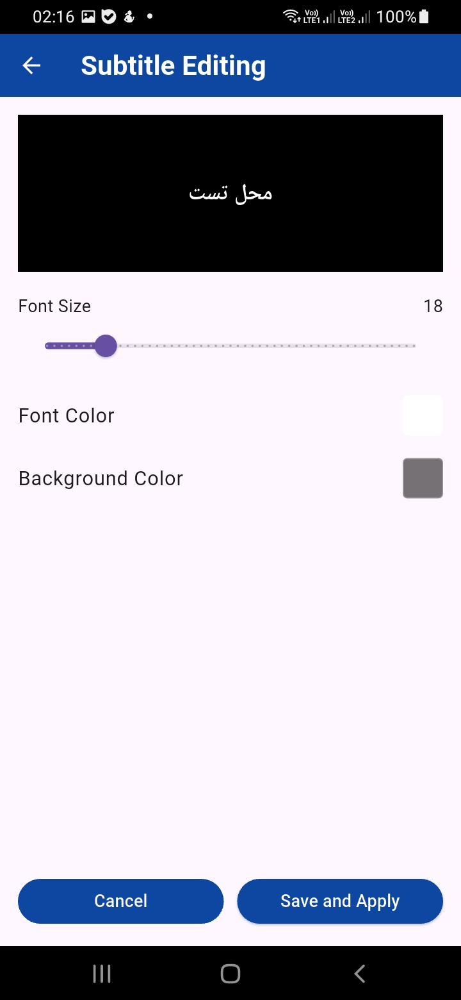
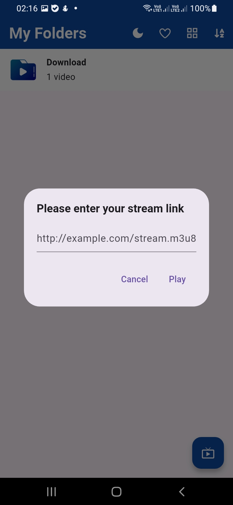

# 🎬 Flutter Video Player – Smart Video Hub

**Created by [@sahandfakoori](https://github.com/sahandfakoori)**

A feature-rich video player built with **Flutter (Dart)**.  
This is one of my first projects – the code may not be perfectly structured, and I got help from AI to learn and build faster.  
Despite that, it’s packed with useful features you’d expect from a modern video player.

---

## ✨ Features

### 🎥 Playback & Control
- 📁 **Play videos from folders** or show all video files in one list
- ▶️ **Playback controls** (play, pause, seek forward/back)
- ⏩ **Playback speed control**
- ✂️ **Trim / cut videos** (select start & end points)
- 📸 **Take screenshots** from any video moment
- 🔒 **Screen lock** – prevent accidental seek, volume, or brightness changes while watching

### 🎚️ Gesture Controls
- Vertical swipe on left → adjust **brightness**
- Vertical swipe on right → adjust **volume**

### 📂 Library Management
- ⭐ **Add to favorites** and manage your watchlist
- 🗑️ **Delete videos** directly from the app
- 📤 **Share videos** with other apps
- 📝 **Add subtitles** to your videos
- 🗂️ **Sort folders** by name or by number of videos inside

### 🎨 Appearance
- 🎮 **Steam-like interface mode** (immersive player UI)
- 🌓 **Change theme** – light / dark mode
---

## 🖼️ Screenshots

| Main Player                          | Favorites                              | Trim Mode                     |
|--------------------------------------|----------------------------------------|-------------------------------|
|  |  |  |

| Gesture Controls                     | Subtitle UI                           | Stream View                            |
|--------------------------------------|---------------------------------------|----------------------------------------|
|  |  |  |

---

## 🛠️ Tech Stack

- **Language:** Dart
- **Framework:** Flutter
- **State Management:** *(setState , bloc)*
- **Video handling:** video_player

---

## ⚠️ Note

> This is one of my early projects. The code is not fully optimized or following all best practices.  
> I used AI assistance extensively while learning Flutter.  
> Feel free to explore, learn, or improve it! Contributions and suggestions are welcome.

---

## 📱 Author

**Sahand Fakoori**  
GitHub: [@sahandfakoori](https://github.com/sahandfakoori)

---

## 📃 License

This project is open source – choose a license if you want (e.g., MIT).